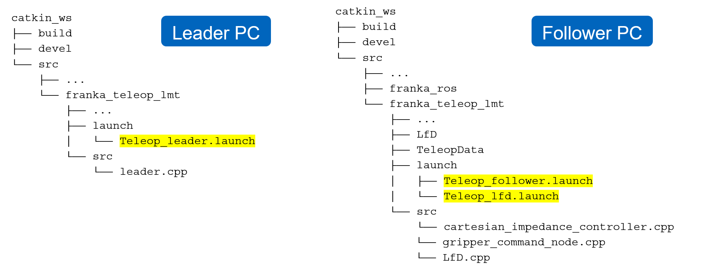
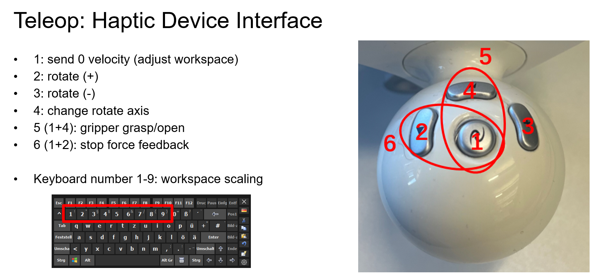

## Hardware and connection setup
The code runs on two separate PCs connected via LAN. Before running the code, check network connectivity between the two PCs with 
    
    $ ping <IP>

After checking connectivity, set up ROS_IP and ROS_MASTER_URI on both leader and follower PC. Here we set follower PC as ROS master and run roscore.

on follower PC:

    $ export ROS_MASTER_URI=http://<follower_ip>:11311 (in every new terminal)
	$ export ROS_IP=<follower_ip> (in every new terminal)
	$ roscore

on leader PC:

    $ export ROS_MASTER_URI=http://<follower_ip>:11311 (in every new terminal)
	$ export ROS_IP=<leader_ip> (in every new terminal)

Then set up the robot arm and haptic device. Franka robot arm is connected to follower PC with LAN cable. Power up the robot and open Franka Desk in browser with robot IP. Unlock robot joints and activate FCI. Haptic device is connected to leader PC with USB cable.

## Run the code
Now we are ready to run the code. Our workspace structure is shown below. 

Teleop_leader.launch receives motion and button commands from haptic device and publish them. Teleop_follower.launch starts the robot controller and pick up the commands to control robot and gripper. Teleop_lfd.launch is for reproduction of the demonstrated trajectories.

### Teleoperation pipeline
First, we use teleoperation to gather demonstration data. 

Open terminal in both leader and follower workspace. On leader PC, run:

    $ roslaunch franka_teleop_lfd Teleop_leader.launch

This starts the leader node, which receives motion and button commands from haptic device and publish them. Next, on follower PC, run:

    $ roslaunch franka_teleop_lfd Teleop_follower.launch robot_ip:=<ip_of_Franka_robot> demo_num_arg:=<number_of_current_demonstration>

This starts the robot controller and pick up the commands to control robot and gripper. Now you can control the robot using haptic device while recording the trajectory of robot end effector. The haptic device interface is shown below. 

The recorded trajectory will be saved under \follower\catkin_ws\src\franka_ros\franka_teleop_lmt\TeleopData according to the assigned demo_num_arg.

### LfD pipeline
After recording enough demonstration trajectories, we run follower\catkin_ws\src\franka_ros\franka_teleop_lmt\LfD\LfD_GMM_GMR_gripper_segmentation_v2_timedriven.m in MATLAB. 

This script automatically reads the recorded demonstrations, segments each demonstration based on changes in gripper state, trains GMM with these segments, and generates new trajectories with GMR. It produces some segment trajectories in learned_seg_n.csv flies.

Then, on follower PC, we run:

    $ roslaunch franka_teleop_lfd Teleop_lfd.launch robot_ip:=<ip_of_Franka_robot>

This starts the lfd node and robot controller. The lfd node reads the generated trajectories and send command to robot and gripper. Now the robot can reproduce the learned trajectories in sequence and complete desired tasks. 

So far, the learning from demonstration pipeline is finished.